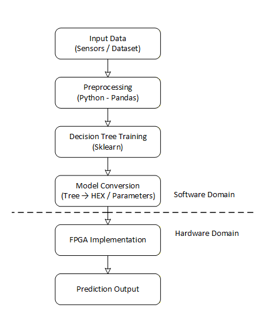

---

# A Machine Learning Approach in FPGA/ASIC Design and Verification

### Case Study: Hardware Implementation of a Greenhouse Crop Yield Predictor

This research studies how machine learning models can be integrated into the FPGA/ASIC design and verification flow. The project explores how ML algorithms can be translated into hardware logic and verified using modern digital verification methodologies.

As a case study, a greenhouse crop yield predictor (CYP) is implemented where environmental sensor data is processed using machine learning and later deployed as FPGA hardware.

---

# Research Status

**Status:** Ongoing

**Goal**

Study how machine learning can support FPGA/ASIC development by:

* implementing ML models in hardware
* designing efficient inference architectures
* verifying ML-based hardware using SystemVerilog UVM
* applying hardware/software co-design techniques

---

# Problem Statement

Machine learning is widely used in software systems, but integration with hardware design flows is still developing.

This research studies a workflow where:

1. ML models are trained in Python.
2. Decision rules are extracted and converted into Verilog modules.
3. The hardware implementation is verified using SystemVerilog UVM.

This enables predictive algorithms to run as hardware accelerators in FPGA/ASIC systems.

### System Design

<p align="center">
  
</p>

# AMBA APB4 Integration

The APB4 design used in this project is based on this repository:

[https://github.com/MohamedHussein27/AMPA_APB4_Protocol](https://github.com/MohamedHussein27/AMPA_APB4_Protocol)

In this repo, that APB4 design is integrated with the existing crop yield predictor so the predictor can be accessed through an APB4-based interface.

APB4 allows:

* writing input feature values
* triggering prediction computation
* storing prediction results
* reading results from registers or memory

### Proposed Architecture

<p align="center">
  
</p>

---

# Dataset Overview

Dataset: Smart Farming Sensor Data for Yield Prediction

[https://www.kaggle.com/datasets/atharvasoundankar/smart-farming-sensor-data-for-yield-prediction/data](https://www.kaggle.com/datasets/atharvasoundankar/smart-farming-sensor-data-for-yield-prediction/data)

The dataset contains environmental variables affecting crop growth and is used to train a greenhouse crop yield predictor.

### Feature Description

| Column Name | Description |
| --- | --- |
| soil_moisture | Soil moisture content in percentage |
| soil_pH | Soil pH level (5.5-7.5 typical range) |
| temperature_C | Average temperature during crop cycle (in deg C) |
| rainfall_mm | Total rainfall received in mm |
| humidity | Average humidity level in percentage |
| Sunlight_hours | Average sunlight hours received per day |
| N | Nitrogen content in the soil |
| P | Phosphorus content in the soil |
| K | Potassium content in the soil |
| wind_speed | Wind speed during the crop cycle |
| yield_kg_per_hectare | Target variable: Crop yield in kilograms per hectare |

---

# Machine Learning Tools and Libraries

The ML pipeline is implemented in Python using `pandas` for preprocessing and `numpy` for numerical operations. A Decision Tree model from `scikit-learn` (sklearn) is also used for training and prediction.

---

# Hardware Design Approach

Models used:

* Decision Tree Regressor
* Random Forest

Design flow:

1. Train ML models in Python.
2. Extract decision rules.
3. Convert rules into Verilog hardware modules.
4. Implement the design on FPGA.

Decision nodes are mapped to comparators, control logic, and arithmetic operations to build a hardware inference engine.

### Example Decision Tree Output

<p align="center">
  
</p>

---

# Verification Methodology

<p align="center">
  
</p>

The hardware design is verified using a SystemVerilog UVM environment. The current setup uses 1 active agent and 2 passive agents to check that hardware predictions stay aligned with the software reference.

---

# How to Run the Project

The project contains a Machine Learning pipeline and an FPGA flow.

## Machine Learning

Navigate to:

```
Codes\Machine Learning\project_2
```

Run:

```
make env
make run
```

This trains the model and generates outputs for the hardware implementation.

## FPGA Flow

Navigate to:

```
Codes\FPGA Flow\scripts
```

Run the simulation script.

**Windows**

```
run.bat
```

**Linux**

```
./run.sh
```

### FPGA Flow Overview

<p align="center">
  
</p>

---

# Project Structure

```
Project
|
+-- Docs
|   `-- presentations and documentation
|
`-- Codes
    +-- Machine Learning
    `-- FPGA Flow
```

**Docs** contains project presentations and documentation.  
**Codes** contains the ML pipeline and FPGA implementation.

---

# Authors

Ali Adel  
[ali.adel@email.com](mailto:ali.adel@email.com)

Hazem Alaa  
[https://github.com/H-Electro](https://github.com/H-Electro)

## Advisors

Dr. Heba Draz  
LinkedIn: [linkedin](https://www.linkedin.com/in/hebatullah-draz-b1385a236)  
Email: [hdraz@aucegypt.edu](mailto:hdraz@aucegypt.edu)

Dr. Ratshih Sayed  
LinkedIn: [linkedin](https://www.linkedin.com/in/ratshih-sayed-4713ab62)

**Course**  
Hardware/Software Co-Design - ECIP Internship Program

Institute  
Electronics Research Institute  
[https://eri.sci.eg](https://eri.sci.eg)

---

# References

[1] IEEE Std 1800-2017 SystemVerilog Standard  
[https://rfsoc.mit.edu/6S965/_static/F24/documentation/1800%202017.pdf](https://rfsoc.mit.edu/6S965/_static/F24/documentation/1800%202017.pdf)

[2] Verification Academy - UVM Runtime Phases  
[https://verificationacademy.com/topics/uvm-universal-verification-methodology/functional-verification-of-digital-logic](https://verificationacademy.com/topics/uvm-universal-verification-methodology/functional-verification-of-digital-logic)

[3] Random Forest  
[https://en.wikipedia.org/wiki/Random_forest](https://en.wikipedia.org/wiki/Random_forest)

[4] Decision Tree Example  
[https://www.displayr.com/what-is-a-decision-tree](https://www.displayr.com/what-is-a-decision-tree)

[5] Smart Farming Sensor Data Dataset  
[https://www.kaggle.com/datasets/atharvasoundankar/smart-farming-sensor-data-for-yield-prediction/data](https://www.kaggle.com/datasets/atharvasoundankar/smart-farming-sensor-data-for-yield-prediction/data)

[6] SystemVerilog UVM Guide  
[https://www.accellera.org/downloads/standards/uvm](https://www.accellera.org/downloads/standards/uvm)

[7] FPGA Design Tools  
[https://www.xilinx.com/products/design-tools.html](https://www.xilinx.com/products/design-tools.html)

[8] Round to Even  
[https://blogs.sas.com/content/iml/2019/11/11/round-to-even.html](https://blogs.sas.com/content/iml/2019/11/11/round-to-even.html)

[9] IEEE-754 Floating Point Numbers  
[https://www.geeksforgeeks.org/computer-organization-architecture/ieee-standard-754-floating-point-numbers](https://www.geeksforgeeks.org/computer-organization-architecture/ieee-standard-754-floating-point-numbers)

[10] Computer Architecture and Organization  
[https://pages.cs.wisc.edu/~david](https://pages.cs.wisc.edu/~david)

[11] Hardware/Software Co-Design Process  
[https://resources.altium.com/p/whats-hardwaresoftware-co-design-process](https://resources.altium.com/p/whats-hardwaresoftware-co-design-process)

[12] Machine Learning  
[https://en.wikipedia.org/wiki/Machine_learning](https://en.wikipedia.org/wiki/Machine_learning)

[13] FPU Float to Int Implementation  
[https://github.com/dawsonjon/fpu/tree/master/float_to_int](https://github.com/dawsonjon/fpu/tree/master/float_to_int)

[14] IEEE-754 FPU Repository  
[https://github.com/akilm/FPU-IEEE-754/tree/main](https://github.com/akilm/FPU-IEEE-754/tree/main)

[15] Decision Tree + LUT for FPGA  
[https://github.com/Arif-miad/crop-yield-prediction-app/blob/main/requirements.txt](https://github.com/Arif-miad/crop-yield-prediction-app/blob/main/requirements.txt)

[16] Smart Crop Recommendation Dataset Code  
[https://www.kaggle.com/datasets/miadul/smart-crop-recommendation-dataset/code](https://www.kaggle.com/datasets/miadul/smart-crop-recommendation-dataset/code)

---
